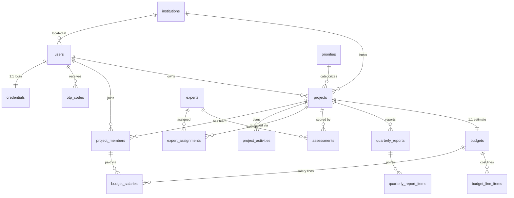

# AZTU E‑Grant — Database Architecture (Redesign Proposal)

> Status: **Proposal — no code changed.** This document is the target schema for
> the E‑Grant backend. Implementation (models + Alembic migration) is a separate,
> later step.
>
> Decisions locked for this revision:
> - **Budget line items are unified** into a single `budget_line_items` table with a
>   `budget_category` enum (equipment / services / rent / other).
> - **Multiple projects per owner are allowed** — the current accidental
>   "one project per owner" behaviour (caused by `project.fin_kod UNIQUE`) is
>   intentionally dropped.

---

## 1. Domain

A university grant-application platform. Researchers (teachers / PhD / master
students) submit grant **projects**, build a team of **collaborators**, attach a
budget estimate (**smeta**) made of line items (salaries, equipment, services,
rent, other), define a monthly **activity** plan, and file **quarterly reports**.
**Experts** are assigned to review projects and submit **assessments**. Everything
is scoped to **institutions** and tagged with a research **priority**.

Glossary (Azerbaijani → English): `smeta` = budget/estimate · `fin_kod` = FIN
(national ID code) · `prioritet` = priority · `kafedra/department` = department.

---

## 2. Diagnosis — why the current models are a "mess"

| # | Problem | Where | Consequence |
|---|---------|-------|-------------|
| 1 | **Zero foreign keys** — all joins are implicit on `project_code`, `fin_kod`, `institution_code`, `expert`(email) | every model | Orphan rows, no cascade, no referential integrity |
| 2 | **Broken composite PKs** — `id` *and* `project_code` both `primary_key=True` | `salaryModel:7-8`, `subjectModel:8`, `servicesTableModel:7` | PK becomes `(id, project_code)`; only works because code uses `filter_by`, never `get()` |
| 3 | **Wrong unique constraint** — `Collaborator.fin_kod UNIQUE` | `collaboratorModel:9` | A person can collaborate on **only one project ever**; 2nd join crashes |
| 4 | **Type drift** — `project_code` is `Integer` in `project`, `BigInteger` in reports; `fin_kod` is `Text` / `String(100)` / `String` | project vs report vs auth | Join/index mismatches |
| 5 | **Magic-int status** — `user_type`, `project_role`, `approved`(int), `submitted`(bool), `blocked`(int) | `authModel`, `projectModel` | Ambiguous states, no constraint, comments instead of enums |
| 6 | **Denormalized totals** — `Smeta.total_*` manually kept in sync with line items | `salaryController:63,177` | Drift; totals lie if any write fails mid-way |
| 7 | **String linkage for experts** — `Project.expert` = email text, `Assessment.expert` = email text | `projectModel:23`, `assessmentModel:9` | No integrity; renaming an email breaks history |
| 8 | **`point_1 … point_17`** repeating columns | `reportModel` | Classic repeating-group anti-pattern |
| 9 | **4 near-identical line-item tables** (equipment/services/rent/other) | `smetaModels/*` | Duplication; same shape copy-pasted |
| 10 | **Profile bloat & naming** — `image LargeBinary` inline, typos (`additonal_education`, `prioritet`/`priotet`) | `userModel`, `projectModel` | Row bloat, inconsistent naming |
| 11 | **`Auth` vs `User` 1:1 not enforced**, OTP keyed by raw `fin_kod` string | `authModel`, `otpModel` | Drift between the two tables |

---

## 3. Design principles

1. **Surrogate PK everywhere** (`id` BIGINT identity). Joins use surrogate FKs —
   *never* propagate natural keys (`fin_kod`, `project_code`) as join columns.
2. **Natural keys stay as `UNIQUE` business columns** (`users.fin_kod`,
   `projects.project_code`) — human-facing, indexed, but not the relational glue.
   They remain stable for existing frontends.
3. **Real FKs with explicit `ON DELETE`** (CASCADE for project children, RESTRICT
   for lookups).
4. **Enums replace magic integers** (Postgres native enums — DB confirmed Postgres
   from the migration's `*_key`/`*_pkey` naming).
5. **Line items are the single source of truth; totals are computed** (Postgres
   `GENERATED … STORED` columns + a `v_budget_totals` view; optional cached header).
6. **Consistent conventions:** `snake_case`, plural table names,
   `created_at`/`updated_at timestamptz`, `deleted_at` for soft-deletable entities,
   index every FK.

---

## 4. ER model



---

## 5. Enumerations

```
academic_type     : TEACHER | PHD | MASTER
account_status    : PENDING | APPROVED | BLOCKED
global_role       : APPLICANT | ADMIN | SUPER_ADMIN
project_status    : DRAFT | SUBMITTED | UNDER_REVIEW | APPROVED | REJECTED
member_role       : OWNER | COLLABORATOR
member_status     : PENDING | APPROVED | REJECTED
assignment_status : ASSIGNED | ACCEPTED | DECLINED | COMPLETED
budget_category   : EQUIPMENT | SERVICES | RENT | OTHER
```

---

## 6. Tables (column-level spec)

### 6.1 Identity & access

**`institutions`** *(was `institution`)*
- `id` PK · `code` varchar UNIQUE · `name` varchar UNIQUE · `created_at` · `updated_at`

**`priorities`** *(was `prioritets`)*
- `id` PK · `code` int UNIQUE · `name` text · `created_at` · `updated_at`

**`users`** *(was `User`; absorbs `academic_type` from Auth)*
- `id` PK · `fin_kod` varchar(7) **UNIQUE NOT NULL**
- `global_role` enum default `APPLICANT`
- `academic_type` enum  *(was `Auth.user_type` 0/1/2)*
- identity: `name, surname, father_name, born_date, born_place, sex, citizenship, personal_id_number, living_location`
- contact: `home_phone, personal_mobile_number` UNIQUE, `personal_email` UNIQUE
- work: `work_place, department, duty, work_location, work_phone` UNIQUE, `work_email` UNIQUE
- education: `main_education, additional_education` *(typo fixed)*
- science: `scientific_degree, scientific_degree_date, scientific_title, scientific_title_date` *(renamed from `scientific_name`)*
- `institution_id` **FK → institutions.id** *(replaces `institution_code` string)*
- `avatar_url` text *(move the `LargeBinary` blob to object/file storage; keep a reference)*
- `profile_completed` bool default false
- `created_at` · `updated_at` · `deleted_at`

**`credentials`** *(was `Auth`)*
- `id` PK · `user_id` **FK → users.id UNIQUE NOT NULL** (enforces 1:1)
- `password_hash`
- `status` enum `account_status` *(collapses `approved` + `blocked`)*
- `otp_verified` bool default false
- `approved_at, blocked_at, unblocked_at, created_at, updated_at`
- *`project_role` removed* — project-scoped → `project_members.role`; the `SUPER_ADMIN`
  value moves to `users.global_role`.

**`otp_codes`** *(was `otp`)*
- `id` PK · `user_id` **FK → users.id** · `code` varchar · `issued_at` · `expires_at` · `consumed_at`
- INDEX(`user_id`, `expires_at`)

**`experts`**
- `id` PK · `email` UNIQUE · `name, surname, father_name`
- `personal_id_serial_number` UNIQUE · `work_place, duty, scientific_degree, phone_number`
- `user_id` FK → users.id *nullable* (only if an expert also logs in) · `created_at` · `updated_at`

### 6.2 Projects

**`projects`** *(was `project`)*
- `id` PK · `project_code` bigint **UNIQUE NOT NULL** (random 8-digit business key, kept)
- `owner_id` **FK → users.id NOT NULL** *(replaces `fin_kod`; **NOT unique** → multiple projects per owner allowed)*
- `institution_id` **FK → institutions.id**
- `priority_id` **FK → priorities.id** *(replaces `priotet` text)*
- content: `project_name, project_purpose, annotation, key_words, scientific_idea, structure, team_characterization, monitoring_plan, assessment_plan, requirements, deadline`
- `status` enum `project_status` *(replaces `approved` int + `submitted` bool)* · `submitted_at`
- `collaborator_limit` int default 7 · `max_budget_amount` int default 30000 *(was `max_smeta_amount`)*
- `created_at` · `updated_at` · `deleted_at`

**`project_members`** *(replaces `collaborators`; also models the owner)*
- `id` PK · `project_id` **FK → projects.id ON DELETE CASCADE** · `user_id` **FK → users.id**
- `role` enum `member_role` · `status` enum `member_status`
- `joined_at, approved_at, created_at, updated_at`
- **UNIQUE(`project_id`, `user_id`)** ← fixes the global-unique `fin_kod` bug; allows many
  projects per person and many collaborators per project

**`project_activities`**
- `id` PK · `project_id` **FK CASCADE** · `month` int · `activity_name` text · `created_at` · `updated_at`
- INDEX(`project_id`, `month`)

**`expert_assignments`** *(replaces `Project.expert` text)*
- `id` PK · `project_id` **FK CASCADE** · `expert_id` **FK → experts.id**
- `status` enum `assignment_status` · `assigned_at, responded_at`
- **UNIQUE(`project_id`, `expert_id`)**

**`assessments`**
- `id` PK · `project_id` **FK CASCADE** · `expert_id` **FK → experts.id**
- `score` int *(was `assessment`)* · `note` text · `created_at` · `updated_at`
- **UNIQUE(`project_id`, `expert_id`)**

**`quarterly_reports`**
- `id` PK · `project_id` **FK CASCADE** · `quarter_number` int · `year` int · `submission_date`
- `created_at` · `updated_at` · **UNIQUE(`project_id`, `year`, `quarter_number`)**

**`quarterly_report_items`** *(replaces `point_1..point_17`)*
- `id` PK · `report_id` **FK → quarterly_reports.id CASCADE** · `item_no` int · `content` text
- **UNIQUE(`report_id`, `item_no`)**
- *Alternative:* a single `points jsonb` column on `quarterly_reports` if the 17 points
  are truly free-form.

### 6.3 Budget (Smeta)

**`budgets`** *(was `smeta`; 1:1 with project)*
- `id` PK · `project_id` **FK → projects.id UNIQUE NOT NULL CASCADE**
- `total_fee` int, `defense_fund` int *(policy values)*
- cached rollups `total_salary, total_equipment, total_services, total_rent, total_other, grand_total`
  — **refreshed transactionally from line items**, with `v_budget_totals` view as the authority
- `created_at` · `updated_at`

**`budget_salaries`** *(was `salary_smeta`; fixes double-PK)*
- `id` PK *(single)* · `budget_id` **FK → budgets.id CASCADE**
- `member_id` **FK → project_members.id** *(replaces `fin_kod` text — ties salary to a real team member)*
- `salary_per_month` int · `months` int
- `total_amount` int **GENERATED ALWAYS AS (`salary_per_month * months`) STORED**
- **UNIQUE(`budget_id`, `member_id`)**

**`budget_line_items`** *(unifies `subject_of_purchase` + `services` + `rent_table` + `other_expenses`)*
- `id` PK · `budget_id` **FK CASCADE** · `category` enum `budget_category`
- `item_name` text · `unit_of_measure` text · `unit_price` int · `quantity` int · `duration` int default 1
- `total_amount` int **GENERATED ALWAYS AS (`unit_price * quantity * duration`) STORED**
- `created_at` · `updated_at` · INDEX(`budget_id`, `category`)

> Mapping from old tables: `subject_of_purchase` → `category='EQUIPMENT'` (`equipment_name`→`item_name`,
> `price`→`unit_price`, `duration`=1); `services` → `category='SERVICES'` (`services_name`→`item_name`,
> `duration`=1); `rent_table` → `category='RENT'` (`rent_area`→`item_name`); `other_expenses` →
> `category='OTHER'` (`expenses_name`→`item_name`).

**View `v_budget_totals`** — authoritative total, lets cached columns be verified/rebuilt:

```sql
SELECT b.id AS budget_id,
       COALESCE(s.salary,0)                                  AS total_salary,
       COALESCE(li.equipment,0)                              AS total_equipment,
       COALESCE(li.services,0)                               AS total_services,
       COALESCE(li.rent,0)                                   AS total_rent,
       COALESCE(li.other,0)                                  AS total_other,
       COALESCE(s.salary,0) + COALESCE(li.total,0)
         + b.total_fee + b.defense_fund                      AS grand_total
FROM budgets b
LEFT JOIN (SELECT budget_id, SUM(total_amount) salary
           FROM budget_salaries GROUP BY budget_id) s ON s.budget_id = b.id
LEFT JOIN (SELECT budget_id,
             SUM(total_amount) total,
             SUM(total_amount) FILTER (WHERE category='EQUIPMENT') equipment,
             SUM(total_amount) FILTER (WHERE category='SERVICES')  services,
             SUM(total_amount) FILTER (WHERE category='RENT')      rent,
             SUM(total_amount) FILTER (WHERE category='OTHER')     other
           FROM budget_line_items GROUP BY budget_id) li ON li.budget_id = b.id;
```

The `max_budget_amount` check (currently a hard-coded `30000` at submit time) becomes:
`grand_total <= projects.max_budget_amount`.

---

## 7. Table inventory (16 → 16, but integrity-clean)

`institutions, priorities, users, credentials, otp_codes, experts, projects,
project_members, project_activities, expert_assignments, assessments,
quarterly_reports, quarterly_report_items, budgets, budget_salaries,
budget_line_items` — every relationship FK-enforced, every status an enum, every
total computed. (4 line-item tables collapse into 1; `quarterly_report_items` is
added; net table count is similar but the relational integrity is fully enforced.)

---

## 8. Old → new field mapping (for migration)

| Old | New |
|-----|-----|
| `User.institution_code` (string) | `users.institution_id` (FK) |
| `Auth.user_type` (0/1/2) | `users.academic_type` enum |
| `Auth.project_role` (0/1/2) | `project_members.role` + `users.global_role` (for SUPER_ADMIN) |
| `Auth.approved` + `Auth.blocked` | `credentials.status` enum |
| `Project.fin_kod` (owner) | `projects.owner_id` (FK, not unique) |
| `Project.priotet` (text) | `projects.priority_id` (FK) |
| `Project.expert` (email text) | `expert_assignments.expert_id` (FK) |
| `Project.approved` + `Project.submitted` | `projects.status` enum |
| `Collaborator.*` | `project_members.*` (drop `fin_kod` UNIQUE) |
| `Assessment.expert` (email) | `assessments.expert_id` (FK) |
| `QuarterlyReport.point_1..17` | `quarterly_report_items` rows |
| `salary_smeta` (double PK, `fin_kod` text) | `budget_salaries` (single PK, `member_id` FK) |
| `subject_of_purchase` / `services` / `rent_table` / `other_expenses` | `budget_line_items` (category enum) |
| `Smeta.total_*` (manual) | `budgets` cached + `v_budget_totals` view |

---

## 9. Migration risk notes

- **Keep `project_code` and `fin_kod`** as stable UNIQUE columns even though internal
  joins switch to surrogate FKs — external frontends reference them.
- **`collaborators.fin_kod UNIQUE` removal** is the highest-value fix but needs a
  dedupe pass on existing rows first.
- **Backfill order:** institutions/priorities → users → credentials → projects →
  project_members → budgets → line items → reports.
- Enums + generated columns + partial/filtered indexes are Postgres features —
  appropriate given the confirmed Postgres backend.
- Consider a follow-up table for the file-based app lock (`lock_status.json` /
  `lockController`) → a `system_settings` row, but it is out of scope for the core
  data model.
```